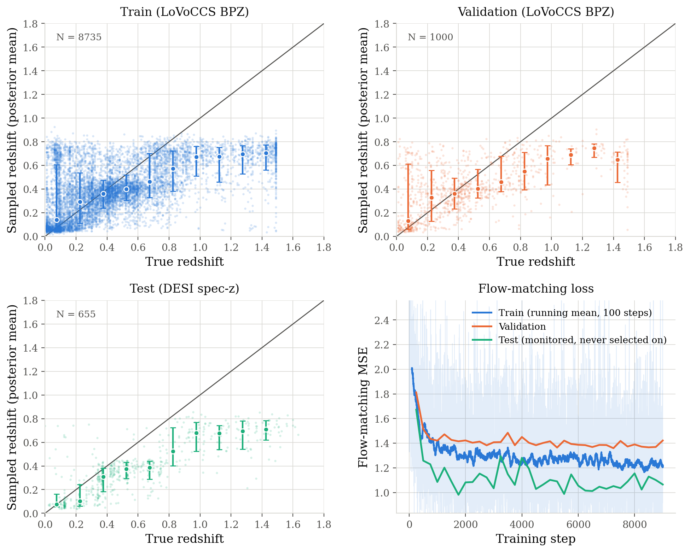

The code in this repository trains machine learning models to estimate photometric redshifts for galaxies observed by the Super-pressure Balloon-borne Imagine Telescope ([SuperBIT](10.3847/1538-3881/ac9b1c)). The galaxy redshifts used for training are overlapping galaxies from the Local Volume Complete Cluster Survey ([LoVoCCS](10.3847/1538-4357/ad67c6)) and from the Dark Energy Spectroscopic Instrument survey ([DESI](https://www.desi.lbl.gov/the-desi-survey/)). 

The modle uses `Jax` to create a model with convolutional neural network (CNN) and multi-layered perceptron (MLP) inputs with a flow matching head. The MLP inputs are the magnitudes and image-plane radii of the observed galaxy in each of the three SuperBIT filters (U, B, G) for a total of 6 inputs. The CNN is trained using vignettes from each filter; this includes the raw vignettes and PSF weighted vignettes. Below are some examples of SuperBIT images that the model is trained on: 

  

It can be seen that in just these three example vignettes, there is a large variation in noise and brightness of the galaxies that are in our sample of $\sim10^4$ SuperBIT galaxies with redshift information. The aim of this project is to develop a code framework that is able to train a model that estimates accurate photometric redshifts despite a small training sample, large variation of noise within images, and with the ambition of producing reliable redshift uncertainties. Here we demonstrate the current effectiveness of the model: 

  

For the training, validation, and test datsets we find that across 200 flow matching samples, the model is able to make reasonable photometric redshift estimations. Initially, the model struggled with high redshift galaxies as the largest redshift bin for the LoVoCCS BPZ pipeline is $z = 1.49$. In particular, since these galaxies could not have redshift that exceeds this redshift, the BPZ redshift for these galaxies are actually a lower bound estimation. A key finding is that the model was able to make predictions that agreed better with the DESI spec-zs when we allowed the model to predict distributions above this threshold while requiring that the original BPZ estimation is still in this distribution and the new mean of the flow matching distribution is within the unertainty bounds of the LoVoCCS BPZ. Using this uncertainty aware target sampling, the model was able to generalize more accurately to higher redshift galaxies. 