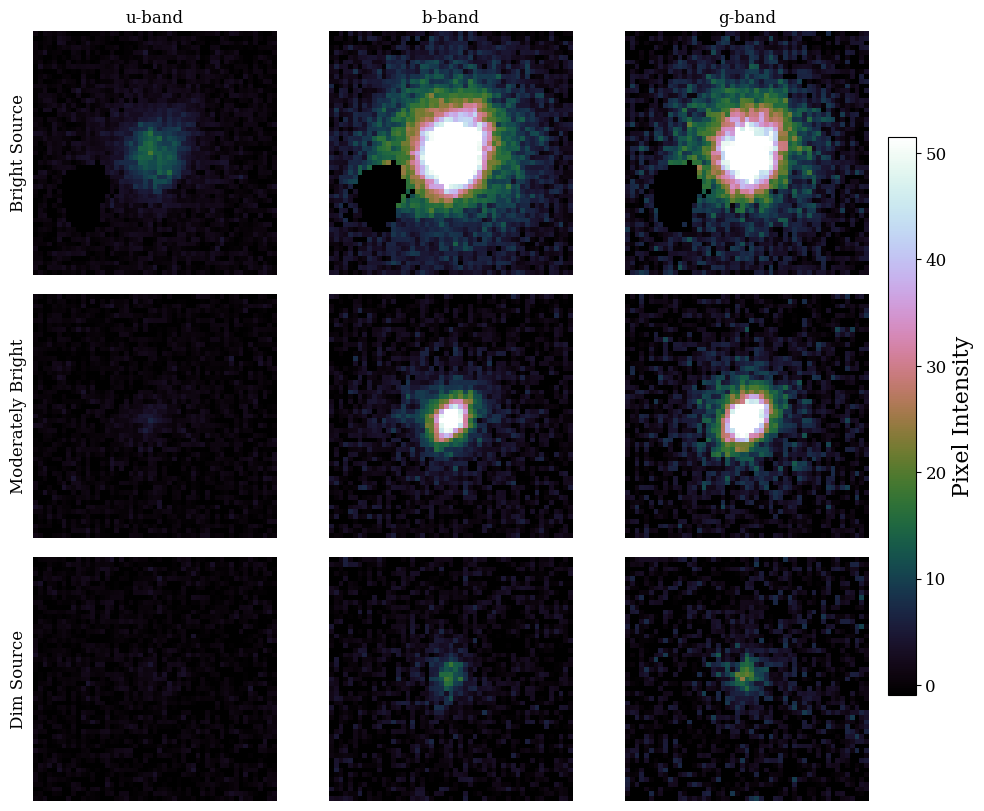

The code in this repository trains machine learning models to estimate redshifts for objects inside of images obtained from the Super-pressure Balloon-borne Imagine Telescope ([SuperBIT](10.3847/1538-3881/ac9b1c)). The redshifts used for training are obtained from overlapping objects inside of the Local Volume Complete Cluster Survey ([LoVoCCS](10.3847/1538-4357/ad67c6)) and from the Dark Energy Spectroscopic Instrument survey ([DESI](https://www.desi.lbl.gov/the-desi-survey/)). 

The repository conatins prototype models inside the `Tensorflow_models` folder and the most up to date models inside the `Jax_models` folder. 

Inside the `Tensorflow_models` folder, the script `mlp_model_train.py` trains a multi-layered perceptron (MLP) using the magnitudes and image-plane radii in each of the three SuperBIT filters (U, B, G) for a total of 6 inputs. In the `cnn_model_train.py` script, a Convolutional Neural Network (CNN) is trained using vignettes from each filter. Each vignette has 51 x 51 pixels. These models are trained only on LoVoCCS redshifts and initial findings suggest that using vignettes are more effective for this task.

Inside the `Jax_models` folder, the weights of the model in the `jax_models.py` script are saved in `cnn_model_params.pkl`. This model is trained using the `training_structure.py` script. The effectiveness of these models are inspected in `model_results.ipynb`. Below are some examples of SuperBIT images that the model is trained on: 

  

It can be seen that in just these three example vignettes, there is a large variation in noise and brightness of the galaxies that are in our sample of $\sim10^4$ SuperBIT galaxies with redshift information. The aim of this project is to develop a code framework that is able to train a model that estimates accurate photometric redshifts despite a small training sample, large variation of noise within images and with the ambition of producing reliable redshift uncertainties. 